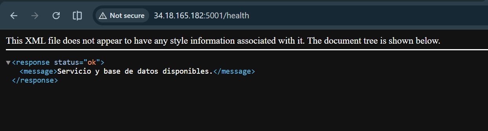

# Evidencias de clase: microservicio bilingue

## Objetivo

El microservicio SOAP existente ahora ofrece consultas REST en XML y JSON. XML se conserva como respuesta predeterminada para mantener compatibilidad con el contrato SOAP; JSON se activa explicitamente con `?format=json` para clientes web y herramientas modernas.

## Resultados obtenidos

| Evidencia | Resultado esperado | Captura |
|---|---|---|
| Health JSON | HTTP 200 y `status: ok` cuando PostgreSQL esta disponible |  |
| Health XML | HTTP 200 y `<status>ok</status>` sin `format` |  |
| Catalogo JSON | Lista de libros, cantidad y datos de catalogo |  |
| Libro por ISBN | Un libro filtrado por `9780451524935` o 404 si no existe |  |
| Libros minimos | ISBN, titulo, autor e imagen por libro |  |
| Cloud Computing | IaaS, PaaS, SaaS y FaaS junto con libros y definiciones |  |

La comprobacion estatica realizada sobre la entrega fue exitosa con `python -m py_compile app.py db/repository.py`. Las capturas de resultados de base de datos deben tomarse al ejecutar los comandos de `GALIA.md` con PostgreSQL configurado.

## Endpoints comprobados

```text
GET /health?format=json
GET /health
GET /books?format=json
GET /books/{isbn}?format=json
GET /books/minimal?format=json
GET /cloud-concepts?format=json
```

## Reflexion

La separacion entre XML y JSON permite que el servicio conserve interoperabilidad con clientes SOAP sin obligar a los consumidores web a procesar sobres XML. Dejar XML como valor predeterminado reduce cambios inesperados para los clientes existentes. El endpoint de libros minimos evita exponer datos innecesarios y entrega la imagen desde `book_images`, respetando la normalizacion de la base de datos. Finalmente, un health check con dos estados comunica de forma observable si el proceso esta vivo y si tambien puede acceder a PostgreSQL; esto facilita diagnostico y monitoreo en una VM de GCP.

## Carpeta de capturas

Guarda las capturas en `evidencias/` con los nombres definidos arriba. No sustituyas una captura de error por una captura de exito: si PostgreSQL no esta disponible, documenta el HTTP 503 de `/health` y corrige la conexion antes de capturar los endpoints de datos.