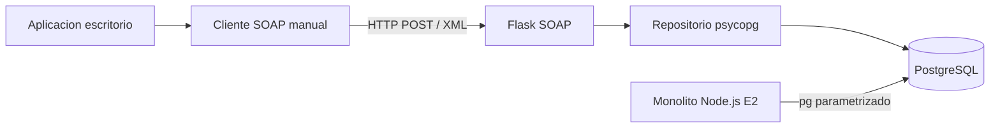

# Reporte tecnico E3

## 1. Arquitectura y responsabilidades

La GUI solo captura datos y consume el endpoint. Flask es propietario del contrato, validacion, SOAP Fault y autenticacion. El repositorio es propietario de SQL parametrizado y transacciones. PostgreSQL conserva las tablas del monolito y las tres tablas nuevas. El monolito continua funcionando sin cambios.

## 2. Decisiones de ingenieria

| Necesidad | Decision | Justificacion | Ventajas | Limitaciones |
|---|---|---|---|---|
| Servicio pequeno | Flask/Python | Coincide con el objetivo y facilita control del XML | Simple, testeable | Requiere endurecer despliegue |
| Contrato interoperable | SOAP document/literal + WSDL/XSD | Clientes Java/.NET pueden generar proxies | Tipado, contrato explicito | XML tiene overhead |
| Control de mensajes | `xml.etree.ElementTree` manual | La actividad exige construir Envelope | Visibilidad del protocolo | Mas codigo de parsing |
| Datos del catalogo | SELECT solo sobre tablas E2 | El servicio necesita libros y conceptos reales | Reutiliza datos | Acoplamiento a nombres del esquema |
| Escrituras | Tablas propias | Aisla la responsabilidad del modulo | No rompe el monolito | Requiere migracion SQL inicial |
| Seguridad | PBKDF2 + WS-Security UsernameToken | No guardar contraseñas en texto plano | Fault distinguible, hash verificable | UsernameToken simple no sustituye TLS |
| Errores | SOAP Fault + HTTP coherente | El cliente necesita distinguir entrada/conflicto/servidor | UX clara, sin stack trace | Debe documentarse en cliente |
| Cliente | Manual y Java | Demuestra interoperabilidad | Compara implementaciones | wsimport depende del JDK |

## 3. Contrato

`ObtenerConceptosPendientes` devuelve ISBN, titulo, concepto, definicion y categoria derivada de `genres`. `RegistrarClasificacion` recibe identidad del clasificador, concepto, ISBN, modelo y datos del cliente. `ObtenerProgresoUsuario` devuelve clasificados/pendientes por correo. `ObtenerEstadisticasPorModelo` es extension compatible y protegida.

## 4. Persistencia y transacciones

`RegistrarClasificacion` valida la pareja `concept_id/isbn`, hace upsert del clasificador, inserta la clasificacion y actualiza el contador de cliente dentro de la misma transaccion. La restriccion `UNIQUE (clasificador_id, concept_id)` detecta duplicados. Un error produce rollback y el cliente recibe solo un mensaje funcional.

## 5. Seguridad

No se usa `users` de E2 para clasificadores. El correo identifica al clasificador dentro de `clasificadores`, pero por si solo no es autenticacion: WS-Security protege la operacion sensible. Las credenciales se representan por hashes PBKDF2 en variables de entorno. En produccion se debe usar HTTPS, rotacion de secretos, rate limiting y un almacen de secretos.

## 6. Interoperabilidad

El cliente Python/Tkinter construye XML directamente. `clients/java/LibrarySoapClient.java` consume el mismo endpoint desde Java. La generacion recomendada es `wsimport -keep -p generated ...`; el proxy generado usa el WSDL, mientras el cliente manual conoce los namespaces y elementos. Ninguno conoce PostgreSQL.

## 7. Acoplamiento y riesgos

1. Renombrar `books.isbn` rompe el SQL; se mitiga con vistas de compatibilidad y una capa de repositorio.
2. Compartir base permite que un error de permisos afecte datos del monolito; se mitiga con rol dedicado y GRANT de solo lectura/escritura limitada.
3. Publicar el WSDL revela operaciones; se mitiga con autenticacion, HTTPS, firewall y no incluir credenciales ni rutas internas.
4. El XML puede amplificar carga; se mitiga con limites de body, timeouts, paginacion futura y logs estructurados.
