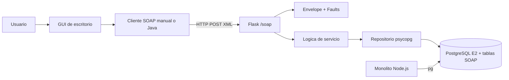

# Parte 10. Documentacion tecnica del modulo SOAP

## Arquitectura y justificacion

El modulo es una aplicacion Flask independiente que recibe HTTP POST con SOAP document/literal. Se eligio esta arquitectura porque conserva el monolito Node.js sin modificarlo y define una frontera explicita entre clientes de escritorio, contrato, logica de servicio, persistencia y PostgreSQL.



Patrón aplicado: capas/adaptador. Flask es adaptador HTTP, `soap/` es adaptador de mensajería y seguridad, `service.py` coordina casos de uso, y `db/repository.py` es el puerto de persistencia. Así se pueden probar Faults sin PostgreSQL usando un repositorio falso.

## Organización de módulos

| Módulo | Responsabilidad |
|---|---|
| `app.py` | Publicar `/soap`, `/health` y WSDL |
| `config/settings.py` | Leer variables de entorno sin credenciales en código |
| `soap/envelope.py` | Namespaces, lectura y construcción XML con ElementTree |
| `soap/service.py` | Operaciones, validación, autorización y coordinación |
| `soap/faults.py` | SOAP Fault y códigos HTTP |
| `soap/security.py` | UsernameToken y verificación PBKDF2 |
| `db/repository.py` | SQL parametrizado, transacciones y contadores |
| `wsdl/` | Contrato WSDL/XSD interoperable |
| `clients/` | GUI Python y cliente Java sin SQL |
| `tests/` | Casos positivos y negativos |

## Contrato y funcionalidades

- `ObtenerConceptosPendientes`: integra `books`, `concepts`, `book_concepts`, `genres` y `book_genres`; expone `category` como transformación contractual.
- `RegistrarClasificacion`: valida concepto/libro, modelo Cloud y clasificador; registra la clasificación y el cliente atendido en una transacción.
- `ObtenerProgresoUsuario`: devuelve clasificados y pendientes por correo.
- `ObtenerEstadisticasPorModelo`: agrupa IaaS/PaaS/SaaS/FaaS y requiere UsernameToken.

El WSDL define mensajes, tipos XSD, portType, binding document/literal y endpoint. No expone precio, stock, hashes, sesiones, credenciales ni consultas SQL.

## Flujo de información

1. La GUI captura nombre, apellidos, correo, ISBN, concepto y modelo.
2. El cliente arma el Envelope y escapa valores XML.
3. Flask separa Header y Body, detecta la operación y valida campos.
4. La lógica consulta o modifica mediante el repositorio.
5. PostgreSQL confirma la transacción o ejecuta rollback.
6. El cliente recibe una respuesta SOAP o un Fault funcional.

## Seguridad, validación y Faults

Los clasificadores viven en `clasificadores`, no en `users` de E2. La operación de estadísticas valida `UsernameToken` contra PBKDF2. En despliegue real se requiere HTTPS, secreto administrado, rotación de credenciales, límites de body, timeouts y rate limiting.

| Situación | Fault | HTTP | Información al cliente |
|---|---|---:|---|
| XML/campos inválidos | `soap:Client` | 400 | Corrección funcional |
| Concepto inexistente | `soap:Client` | 400 | Concepto/libro no válido |
| Modelo inválido | `soap:Client` | 400 | Valores permitidos |
| Duplicado | `soap:Client` + `CONFLICT_409` | 409 | Ya existe |
| Credencial incorrecta | `soap:Client` | 401 | Autenticación inválida |
| PostgreSQL | `soap:Server` | 500 | Mensaje neutro; detalle solo en log |

## Persistencia y permisos

`soap_module.sql` crea `clasificadores`, `clasificaciones_cloud` y `clientes_servidos`, con PK, FK, `CHECK`, `UNIQUE` e índices. `UNIQUE (clasificador_id, concept_id)` impide clasificar dos veces el mismo concepto. El rol de aplicación solo consulta tablas E2 necesarias y escribe/actualiza tablas SOAP. Nunca se usa `postgres` en Flask.

## Despliegue y configuración

```powershell
cd E3/Apps/library_soap_service
python -m venv .venv
.venv\\Scripts\\activate
pip install -r requirements.txt
Copy-Item .env.example .env
python app.py
```

Endpoints: `/health`, `/library-classifier.wsdl` y `/soap`. En producción debe ejecutarse detrás de HTTPS y un servidor WSGI, con logs sin secretos y con el rol dedicado configurado.

## Rendimiento, mantenimiento, interoperabilidad y escalabilidad

La consulta de pendientes usa índices y agregación; para catálogos grandes se debe añadir paginación al contrato. El pool de conexiones y timeouts evitan bloquear recursos. WSDL/XSD permite clientes Java/.NET, pero los cambios obligatorios requieren versionar namespace o agregar campos opcionales. La separación permite reemplazar la GUI, el repositorio o el despliegue sin cambiar el contrato.

## Decisiones con trade-off

| Necesidad | Decisión | Justificación | Ventaja | Limitación |
|---|---|---|---|---|
| Interoperabilidad | SOAP + WSDL/XSD | Contrato formal y generación de clientes | Tipado | XML verboso |
| Control didáctico | ElementTree manual | La actividad exige Envelope manual | Visibilidad | Más código |
| Aislamiento | Tablas propias | No modificar E2 | Menor impacto | Migración inicial |
| Seguridad | PBKDF2 + UsernameToken | No texto plano | Verificación explícita | Requiere TLS |
| Evolución | Namespace y tipos estables | Evitar romper clientes | Mantenibilidad | Versionado necesario |

## Evidencias de la construcción

La documentación técnica se acompaña de capturas consecutivas en `../../../images/T3/`. La Parte 10 de la página web resume cada una y la tarjeta visual queda lista para mostrar el PNG cuando se incorpore:

| Captura | Aspecto documentado | Qué debe mostrar |
|---|---|---|
| `18.PNG` | Documentación técnica | Índice, arquitectura, módulos y decisiones del documento |
| `24.PNG` | Contrato WSDL y XSD | Operaciones, tipos, binding y datos que se excluyen |
| `25.PNG` | Cliente Java | Generación o compilación del cliente interoperable |
| `26.PNG` | Ejecución Java | Consumo del mismo contrato desde otro lenguaje |
| `27.PNG` | Métricas | Bytes de request/response y líneas relevantes del servicio |

No deben capturarse ni publicarse `.env`, contraseñas, hashes reutilizables, tokens, cadenas de conexión ni secretos de WS-Security. La evidencia debe mostrar únicamente la salida funcional necesaria para reproducir la decisión técnica.
