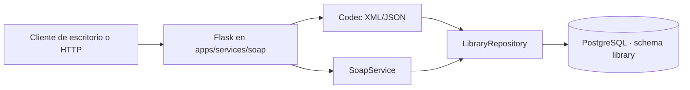

# Arquitectura

`app.py` coordina la aplicación y el ciclo HTTP. `xml_codec.py` y
`json_codec.py` son adaptadores de representación. `soap_service.py` es dueño
del contrato SOAP, validación y Faults. `repository.py` concentra SQL
parametrizado, transacciones y pool. El esquema `library` mantiene el catálogo
y las tablas propias del clasificador en el mismo límite de persistencia.

El pool es lazy: el proceso puede arrancar y servir documentación aunque la
base esté apagada. Las consultas tienen `connect_timeout` y las solicitudes
esperan por una conexión solo durante `DB_POOL_TIMEOUT`.
